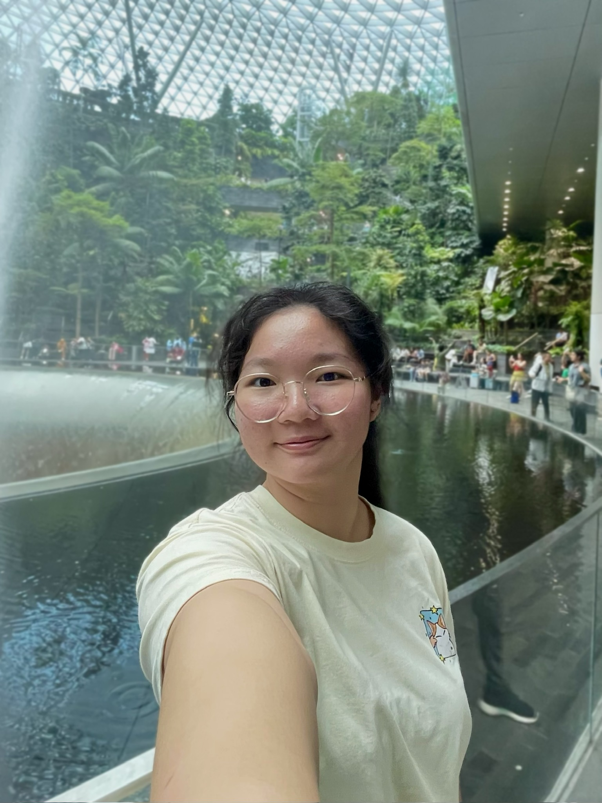
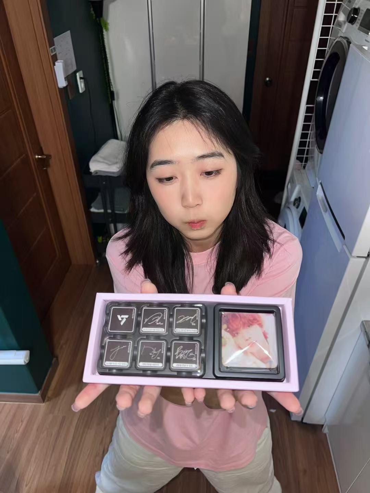
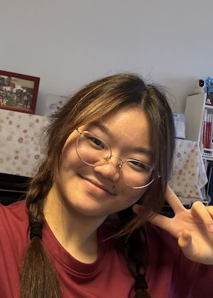

# About Us

We are a team based in the [School of Computing, National University of Singapore](http://www.comp.nus.edu.sg).

You can reach us at the email `seer[at]comp.nus.edu.sg`

## Project team

### Deepa Malika

[[github](https://github.com/deepa-m1)]

* Role: Software Developer

### Theresia

[[github](http://github.com/theresiaong)]

* Role: Developer
* Responsibilities: UI

### Wong Wei Feng

[[github](http://github.com/Hypovolemic)]

* Role: Developer
* Responsibilities: Data

### Yang Yatong

[[github](http://github.com/yalasoo)]

* Role: Developer
* Responsibilities: Dev Ops + Threading

### Zeng Jing

[[github](http://github.com/zjaoyuki)]

* Role: Developer
* Responsibilities: UI
