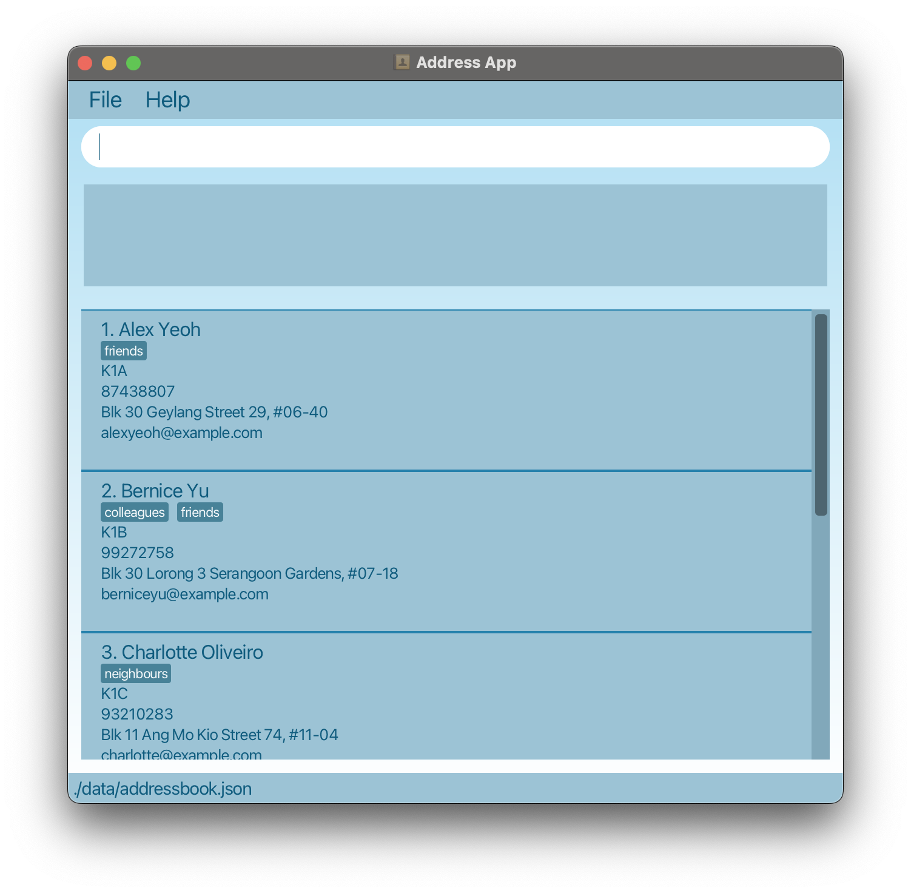

# LittleLogBook

LittleLogBook is a **desktop app for managing contacts, optimized for use via a Command Line Interface** (CLI) while still having the benefits of a Graphical User Interface (GUI). If you can type fast, LittleLogBook can get your contact management tasks done faster than traditional GUI apps.

<!-- * Table of Contents -->
<page-nav-print />

--------------------------------------------------------------------------------------------------------------------

## Quick start

1. Ensure you have Java `17` or above installed in your Computer. 
   **Mac users:** Ensure you have the precise JDK version prescribed [here](https://se-education.org/guides/tutorials/javaInstallationMac.html).

1. Download the latest `.jar` file from [here](https://github.com/AY2526S1-CS2103T-F14B-1/tp).

1. Copy the file to the folder you want to use as the _home folder_ for your LittleLogBook.

1. **Open and navigate to your jar file using command terminal:**

   **What is `cd`?** `cd` stands for "change directory" - it's a command that lets you navigate to different folders on your computer through the command line.

   **Step-by-step instructions:**

   **For Windows users:**
   - Press `Windows key + R`, type `cmd`, and press Enter to open Command Prompt
   - Type `cd` followed by a space, then the full path to your jar file folder
   - Example: `cd C:\Users\YourName\Desktop\LittleLogBook` (replace with your actual folder path)
   - Press Enter to navigate to that folder
   - Type `java -jar littlelogbook.jar` and press Enter to run the application

   **For Mac/Linux users:**
   - Press `Cmd + Space` (Mac) or `Ctrl + Alt + T` (Linux) to open Terminal
   - Type `cd` followed by a space, then the full path to your jar file folder
   - Example: `cd /Users/YourName/Desktop/LittleLogBook` (replace with your actual folder path)
   - Press Enter to navigate to that folder
   - Type `java -jar littlelogbook.jar` and press Enter to run the application

   **Alternative method (easier for beginners):**
   - Navigate to the folder containing `littlelogbook.jar` using your file explorer
   - **Windows:** Hold Shift + Right-click in the empty space of the folder → Select "Open PowerShell window here" or "Open command window here"
   - **Mac:** Right-click in the folder → Services → New Terminal at Folder
   - **Linux:** Right-click in the folder → "Open in Terminal"
   - Type `java -jar littlelogbook.jar` and press Enter

   A GUI similar to the below should appear in a few seconds. Note how the app contains some sample data. 
   

1. Type the command in the command box and press Enter to execute it. e.g. typing **`help`** and pressing Enter will open the help window. 
   Some example commands you can try:

   * `add n/John Doe p/98765432 e/john.doe@gmail.com c/student` : Adds a contact named `John Doe` with category `student` to LittleLogBook.
   
   * `note 1 desc/Allergic to peanut` : Add the not "Allergic to peanut" to contact at index 1. 

   * `delete n/John Doe` : Deletes the contact named `John Doe`.

   * `view n/John Doe` : Shows full details of the contact named `John Doe`.

   * `find-n John` : Searches for contacts with names containing `John`.
   
   * `find-p 8987` : Searches for contacts with phone number containing `8987`.

   * `find-t student` : Searches for contacts labelled with tag `student`.

   * `exit` : Exits the app.

1. Refer to the [Features](#features) below for details of each command.

--------------------------------------------------------------------------------------------------------------------

## Features

<box type="info" seamless>

**Notes about the command format:** 

* Words in `UPPER_CASE` are the parameters to be supplied by the user. 
  e.g. in `add n/NAME`, `NAME` is a parameter which can be used as `add n/John Doe`.

* Items in square brackets are optional. 
  e.g `n/NAME [t/TAG]` can be used as `n/John Doe t/friend` or as `n/John Doe`.

* Parameters can be in any order. 
  e.g. if the command specifies `n/NAME p/PHONE`, `p/PHONE n/NAME` is also acceptable.

* Extraneous parameters for commands that do not take in parameters (such as `help`, `list`, `exit` and `clear`) will be ignored. 
  e.g. if the command specifies `help 123`, it will be interpreted as `help`.

* If you are using a PDF version of this document, be careful when copying and pasting commands that span multiple lines as space characters surrounding line-breaks may be omitted when copied over to the application.
</box>

### Viewing help : `help`

Shows a message explaining how to access the help page.

Format: `help`

### Adding a contact: `add`

Purpose: Allows teachers to create a new contact entry (student, colleague).

Format: `add n/NAME p/PHONE e/EMAIL c/CATEGORY`

**Parameters & Validation Rules:**
- **Name (n/):** Alphabetic characters, spaces, hyphens, apostrophes only. Leading/trailing spaces trimmed, multiple spaces collapsed. Case-insensitive for duplicates. Error if empty or contains numbers/symbols.
- **Phone (p/):** 8-digit Singapore numbers only. Spaces/dashes ignored. Error if not numeric, wrong length, or invalid starting digit.
- **Email (e/):** Must follow standard email format. Case-insensitive. Error if invalid format.
- **Category (c/):** Acceptable: `student`, `colleague` (case-insensitive). Error if invalid category.

**Duplicate Handling:**
Duplicate if name + phone already exist (case-insensitive). If detected, error message: `Duplicate contact detected.`

Examples:
* `add n/John Doe p/98765432 e/john.doe@gmail.com c/student`
* `add n/Mary Tan p/91234567 e/marytan@e.nut.edu c/colleague`

**Outputs:**
- Success: GUI updates contact list, message: `New <CATEGORY> added`
- Failure: Error message with reason (invalid/missing parameter, duplicate, etc.)

### Deleting a contact: `delete`

Purpose: Remove outdated or incorrect contacts from the list.

Format: `delete n/NAME` or `delete INDEX`

**Parameters & Validation Rules:**
- **Name (n/):** Same rules as Add. Case-insensitive match.
- **Index:** The index must be a positive integer (1, 2, 3,...)

Examples:
* `delete n/John Doe`
* `delete 3`

**Outputs:**

Delete by INDEX 
- Success:  List updates, message: `Deleted Person: <Person>`
- Failure: Message: `Invalid command format!`

Delete by NAME 
- Success: Exact match: list updates, message: `Deleted Person: <Person>`
- Failure: Triggers Pop up windows for further confirmation. 
Possible matches and corresponding information will also be displayed in the name list.
  - No match → Pop up window stating `No matches found. Press ESC to exit`
  - Multiple matches → Pop up window stating `Multiple matches found. Type index and ENTER to delete or ESC to cancel`
   

### Viewing contact details: `view`

Purpose: Show full information of a contact (including notes, classes, attendance).

Format: `view INDEX`

**Parameters:**
- INDEX (required): The index number of the contact shown in the displayed contact list.
  - Must be a positive integer (1, 2, 3, ...)
  - Cannot be zero or negative
  - Must correspond to an existing contact in the current list

Example:
* `view 1` - Shows detailed information for the 1st contact in the current list.

**Outputs:**

Success:
- A popup window appears displaying:
  - Full name
  - Personal Information
    - Tags
    - Student class
  - Contact Information
    - Phone number
    - Email address
    - Home address
  - Notes (Scrollable text area)
  - Attendance (Coming soon)

Failure:
- Invalid input for view → `Invalid command format`
- Out Of Bounds index → `Person index provided is invalid`

**Outputs:**
- Success: List updates to show all matching contacts.
- Failure: No results → `No contacts found for "Tan"`

### Adding/Editing notes: `note`

Purpose: Store additional info (student progress, allergies, parent instructions, etc.).

Format: `note INDEX desc/NOTE_TEXT` or `note INDEX` (Remove note)

**Parameters & Validation Rules:**
- **INDEX (required):** The index number of the contact shown in the displayed contact list.
  - Must be a positive number (1, 2, 3, ...)
  - Cannot be 0 or negative
  - Must correspond to an existing contact in the current list
- **Note text (desc/):** The note to be written. Remove current note if omitted or left empty.
  - Accepts all letters, numbers, symbols, spaces
  - Cannot be control characters (e.g. Tab, invisible commands, etc.)
  - Up to 500 characters
  - Leading/trailing spaces trimmed

Examples:
* `note 1 desc/Allergic to peanuts`
* `note 1`

**Outputs:**
- Success:
  - Note added to contact, message: `Added note to Person: <Person>`
  - Empty note → `Removed note from Person: <Person>`
- Failure:
  - No matching index → `The person index provided is invalid`
  - No index provided → `Invalid command format!` (And inform user of correct command format)

### Finding contacts by name : `find-n`
Purpose: Allows teachers to find contacts quickly with partial names(contiguous).

Format: `find-n KEYWORD`

**Parameters:**
- **Keyword:** Alphanumeric string, case-insensitive, matches partial names. Error if empty string.

Examples:
* `find-n John ecka`
* `find-n Tan`

**Outputs:**
- Success: The find-n results in matches: `<x> persons listed!`
- Failure:
    - No match → `0 persons listed!`
    - Empty string → `Invalid command format!` (And inform user of correct command format)

### Finding contacts by phone number : `find-p`
Purpose: Allows teachers to find contacts quickly with partial number(contiguous).

Format: `find-p KEYWORD`

**Parameters:**
- **Keyword:** numeric string, matches partial numbers. Error if empty string.

Examples:
* `find-p 8431 967`
* `find-p 84313390`
* `find-p 3133`

**Outputs:**
- Success: The find-p results in matches: `<x> persons listed!`
- Failure:
    - No match → `0 persons listed!`
    - Empty string → `Invalid command format!` (And inform user of correct command format)

### Finding contacts by tags : `find-t`
Purpose: Allows teachers to find contacts quickly with tags(contiguous).

Format: `find-t KEYWORD`

**Parameters:**
- **Keyword:** alphanumeric string, matches partial tag. Error if empty string.

Examples:
* `find-t student`
* `find-t stu colle`
* `find-t ague`

**Outputs:**
- Success: The find-t results in matches: `<x> persons listed!`
- Failure:
    - No match → `0 persons listed!`
    - Empty string → `Invalid command format!` (And inform user of correct command format)

### Listing all contacts : `list`

Shows a list of all contacts in LittleLogBook.

Format: `list`

### Clearing all entries : `clear`

Clears all entries from LittleLogBook.

Format: `clear`

### Exiting the program : `exit`

Exits the program.

Format: `exit`

### Saving the data

LittleLogBook data are saved in the hard disk automatically after any command that changes the data. There is no need to save manually.

### Editing the data file

LittleLogBook data are saved automatically as a JSON file `[JAR file location]/data/littlelogbook.json`. Advanced users are welcome to update data directly by editing that data file.

<box type="warning" seamless>

**Caution:**
If your changes to the data file makes its format invalid, LittleLogBook will discard all data and start with an empty data file at the next run. Hence, it is recommended to take a backup of the file before editing it. 
Furthermore, certain edits can cause LittleLogBook to behave in unexpected ways (e.g., if a value entered is outside the acceptable range). Therefore, edit the data file only if you are confident that you can update it correctly.
</box>

--------------------------------------------------------------------------------------------------------------------

## FAQ

**Q**: How do I transfer my data to another Computer? 
**A**: Install the app in the other computer and overwrite the empty data file it creates with the file that contains the data of your previous LittleLogBook home folder.

--------------------------------------------------------------------------------------------------------------------

## Known issues

1. **When using multiple screens**, if you move the application to a secondary screen, and later switch to using only the primary screen, the GUI will open off-screen. The remedy is to delete the `preferences.json` file created by the application before running the application again.
2. **If you minimize the Help Window** and then run the `help` command (or use the `Help` menu, or the keyboard shortcut `F1`) again, the original Help Window will remain minimized, and no new Help Window will appear. The remedy is to manually restore the minimized Help Window.

--------------------------------------------------------------------------------------------------------------------

## Command summary

Action     | Format, Examples
-----------|-----------------------------------------------------------------------------------------------------------------------------------
**Add**    | `add n/NAME p/PHONE e/EMAIL c/CATEGORY` e.g., `add n/John Doe p/98765432 e/john.doe@gmail.com c/student`
**Delete** | `delete n/NAME` e.g., `delete n/John Doe`
**View**   | `view INDEX` e.g., `view 1`
**Search** | `search KEYWORD` e.g., `search John`
**Delete** | `delete n/NAME` e.g., `delete n/John Doe` `delete n/INDEX` e.g., `delete 1`
**View**   | `view INDEX` e.g., `view 1`
**Find-n** | `find-n KEYWORD` e.g., `find-n John`
**Find-p** | `find-p KEYWORD` e.g., `find-p 84871234`
**Find-t** | `find-t KEYWORD` e.g., `find-t student`
**Note**   | `note INDEX desc/NOTE_TEXT` e.g., `note 1 desc/Allergic to peanuts`   `note INDEX`  e.g., `note 1`
**List**   | `list`
**Clear**  | `clear`
**Help**   | `help`
**Exit**   | `exit`
